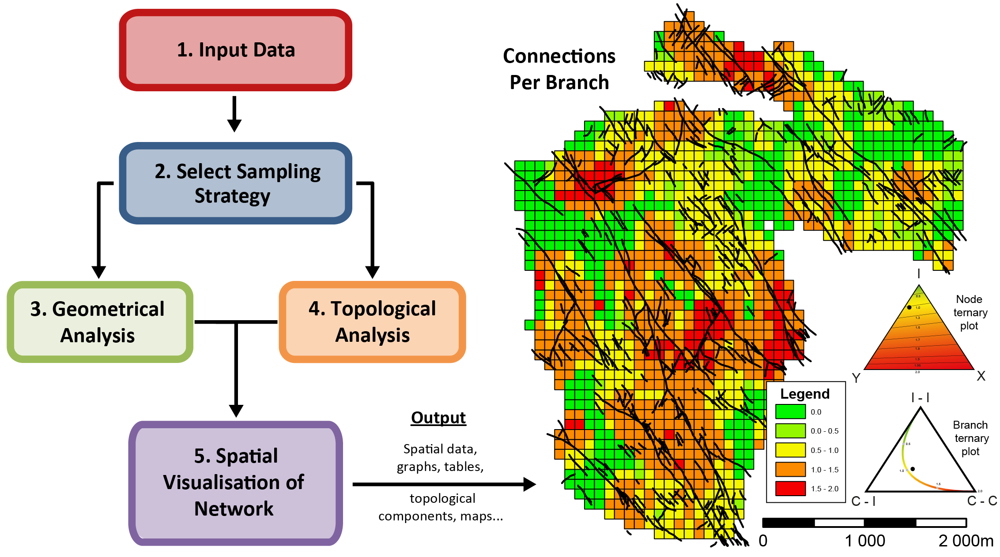

# NetworkGT
The NetworkGT (Network Geometry and Topology) Toolbox is a set of tools designed for the geometric and topological analysis of fracture networks.The toolbox is available as a plugin to QGIS v3.x under the GNU General Public License V3. Please refer to the UserGuide.pdf for installation and workflow.

Current version - v0.1 (13.03.2018)

### Citation

Nyberg, B., Nixon, C.W., Sanderson, D.J., 2018, NetworkGT: A GIS tool for geometric and topological analyses of two-dimensional fracture networks. Geosphere, v. 14, no. 4, doi:10.1130/GES01595.1.
